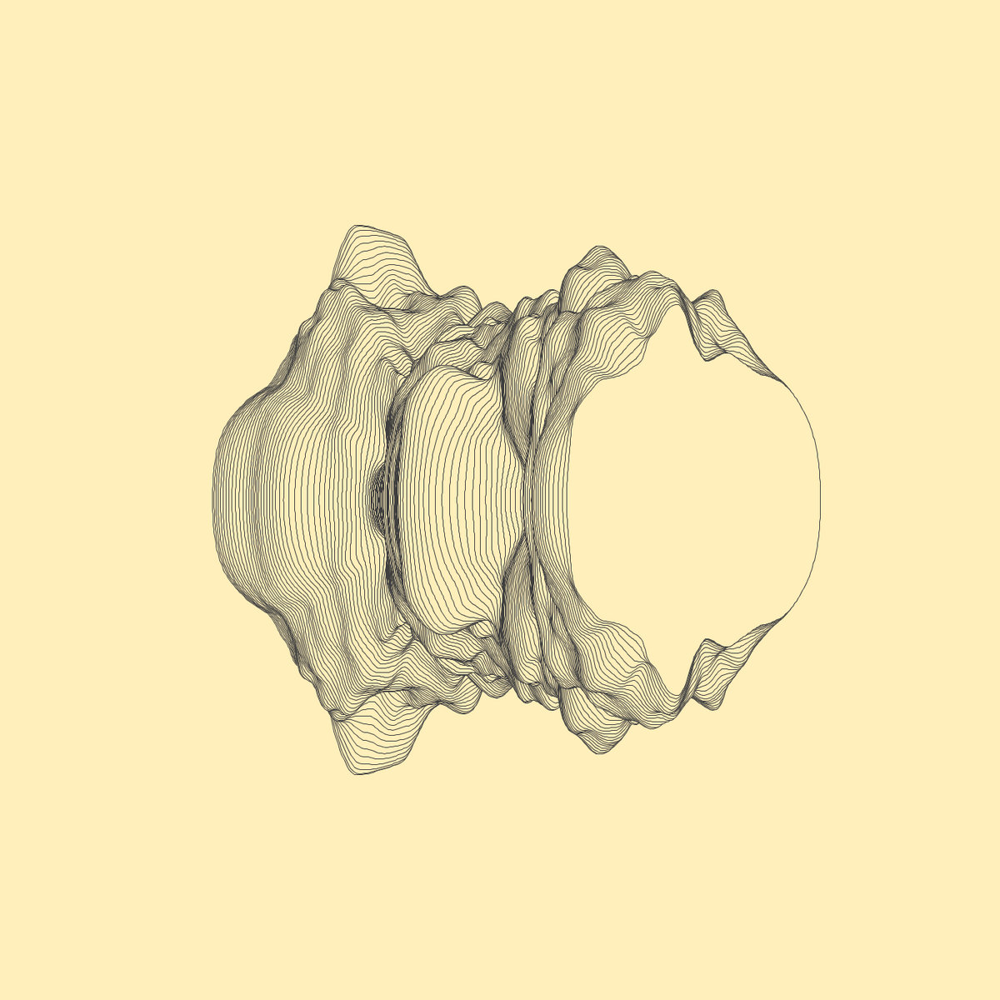

Open sourcing my latest music album *[at the place](https://infinitedigits.bandcamp.com/album/at-the-place)*.

All of the songs are written as miti files in the `songs` directory. Each song is commented with a short description of how it should be played. 

## Materials

- [Korg Monotron](https://www.amazon.com/gp/product/B00684KFAM/ref=as_li_tl?ie=UTF8&camp=1789&creative=9325&creativeASIN=B00684KFAM&linkCode=as2&tag=scholl-20)
- [PO-32](https://www.amazon.com/gp/product/B01MR9L4PL/ref=as_li_tl?ie=UTF8&camp=1789&creative=9325&creativeASIN=B01MR9L4PL&linkCode=as2&tag=scholl-20) (for drums)
- [Raspberry Pi](https://www.amazon.com/gp/product/B07BC7BMHY/ref=as_li_tl?ie=UTF8&camp=1789&creative=9325&creativeASIN=B07BC7BMHY&linkCode=as2&tag=scholl-20) (for midi sequencer and controlling monotron)
- [USB audio adapter](https://www.amazon.com/gp/product/B01N905VOY/ref=as_li_tl?ie=UTF8&camp=1789&creative=9325&creativeASIN=B01N905VOY&linkCode=as2&tag=scholl-20) (for tuning monotron)
- [MCP4725](https://www.amazon.com/gp/product/B00SK8MBXI/ref=as_li_tl?ie=UTF8&camp=1789&creative=9325&creativeASIN=B00SK8MBXI&linkCode=as2&tag=scholl-20) (for controlling monotron)

## Links

- Instructions for building the MIDI-capable monotron: https://github.com/schollz/midi2cv
- Instructions for building the music computer "norns": https://github.com/monome/norns-shield
- All songs are looped using oooooo on norns: https://github.com/schollz/oooooo
- The intro song uses barcode on norns: https://github.com/schollz/barcode
- All songs are sequenced using the miti sequencer: https://github.com/schollz/miti
- Code for generating the album artwork: https://github.com/aaronpenne/generative_art/tree/master/geode

## License

MIT
